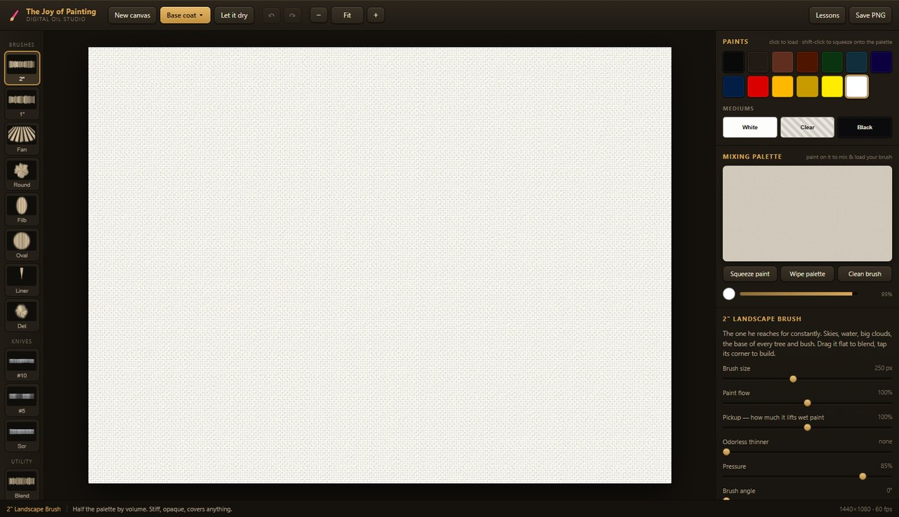

# The Joy of Painting — a digital oil studio

A wet-on-wet oil painting studio that runs in a browser. Bob Ross's thirteen
colours, his brushes and knives, Liquid White, real pigment mixing and paint
you can pile up thick enough to catch the light — with a pen, a mouse, or your
finger.

No build step, no dependencies, no server. Open `index.html` and paint.



## Why it isn't a normal paint program

Bob Ross painted **wet-on-wet**: prime the canvas with a thin coat of oily
white, then work the whole picture in one sitting while everything underneath
is still wet. Colours blend *on the canvas*, not on the palette. That one fact
decides almost everything about how the tools behave — so the app simulates it
rather than drawing strokes.

Every dab does two things. The brush first **picks paint up** off the canvas,
then **puts paint down** a few pixels further along the stroke. That
displacement is the whole trick: it is what blends a sky, drags the snow line
off a mountain's edge, and lets a dirty brush pull the colour underneath into
whatever you paint next. Drag a clean brush across a wet sky and it blends,
because that is what actually happens.

Four more things follow from it:

- **Pigments mix like pigments.** Blue over yellow gives green, not grey, using
  Kubelka–Munk spectral mixing. Each colour also carries its real **tinting
  strength**: a pinhead of Phthalo Blue swallows a pile of Titanium White,
  while Yellow Ochre barely argues with anything.
- **Opacity is separate from colour.** Titanium White buries what is under it;
  Alizarin Crimson laid on the same spot just stains it. This is why a
  highlight wants an opaque colour and a shadow is better transparent.
- **The canvas has tooth.** A cotton-duck weave sits under everything. Press
  hard and paint floods the valleys; barely touch and it only catches the
  peaks — which is how one stroke of white becomes a sparkling, broken
  highlight on a mountain instead of a white stripe.
- **Brushes run out.** A loaded brush lays colour, then starts carrying
  whatever it picked up. Reload, or keep going and let it blend.

Thick paint builds real relief and is lit by a studio light you can move, so
impasto ridges throw shadows.

## The tools

**Brushes** — 2" and 1" landscape, fan, round foliage, filbert, oval, #2 script
liner, detail round.
**Knives** — #10 and #5 painting knives, plus a scraper for taking paint off.
**Utility** — a clean blender (a dry brush with no paint, for softening edges
and misting the base of mountains) and a rag that wipes back to bare canvas.

Each tool is defined by its **footprint** — a picture of the bristles pressed
flat against the canvas. The gaps matter more than the bristles: the spaces
between a fan brush's clumps are what make it read as evergreen boughs.

**Colours** — the same thirteen Bob used, in his palette order: Midnight Black,
Van Dyke Brown, Dark Sienna, Alizarin Crimson, Sap Green, Phthalo Green,
Phthalo Blue, Prussian Blue, Bright Red, Indian Yellow, Yellow Ochre, Cadmium
Yellow, Titanium White.

**Mediums** — Liquid White, Liquid Clear and Liquid Black as base coats or on
the brush, plus an odorless thinner slider that turns any paint into something
that flows off a liner brush.

## Painting with it

1. **Base coat first.** *Base coat → Liquid White.* Almost every painting
   starts here; it is what keeps the canvas wet so everything blends. Use
   Liquid Clear instead when you want to keep an area dark.
2. **Pick a colour.** Click a tube to load your brush. Shift-click to squeeze a
   blob onto the mixing palette instead.
3. **Mix for real.** Squeeze two colours onto the palette and drag a brush
   through both. The palette is a painting surface like any other, so the mix
   on your bristles is a real mix, and it comes with you to the canvas.
4. **Work back to front.** Sky, then the mountains behind, then foothills, then
   trees, then water, then the land you are standing on, then the little sticks
   and twigs, then sign it. The **Lessons** panel walks three paintings through
   this and sets up the tool and colours for each step.
5. **Let it dry** when you want the next layer to sit on top instead of
   blending in.

Pressure comes from a stylus if you have one; with a mouse or finger the
**Pressure** slider does the same job, and it is the control that turns a
covering stroke into a broken dry-brush highlight.

### Keyboard

| | |
|---|---|
| `1`–`0` | pick a tool |
| `[` `]` | brush size |
| `C` | clean the brush ("beat the devil out of it") |
| `Shift`+`D` | let it dry |
| `Ctrl`+`Z` / `Ctrl`+`Shift`+`Z` | undo / redo |
| `Ctrl`+`S` | save a PNG |
| `+` `−` `F` | zoom in, out, fit |
| `Alt`+click | pick a colour off the canvas |
| `Shift`+drag / middle-drag | pan |

## Running it

It is a static site with no build step.

```sh
python -m http.server 8000      # or any static server
# then open http://localhost:8000
```

A server is needed only because the code uses ES modules, which browsers
refuse to load over `file://`.

### GitHub Pages

`.github/workflows/pages.yml` publishes the repository root on every push to
`main`. Enable it once under **Settings → Pages → Build and deployment →
Source → GitHub Actions**. Nothing to build or configure.

## Requirements

A browser with **WebGL2** and floating-point render targets — current Chrome,
Edge, Firefox or Safari. The simulation runs on the GPU; if WebGL2 is missing
the app says so plainly instead of failing silently.

Larger canvases cost more GPU memory and time. *New canvas* offers
12×9 in through 32×24 in; 24×18 in is Bob's usual size and the default.

## How it fits together

```
index.html            the page; the panels are a DOM overlay on one GL canvas
styles.css
src/
  core/
    gl.js             WebGL2 helpers: programs, render targets, ping-pong
    shaders.js        the simulation: pickup, deposit, base coat, lighting
    engine.js         surfaces, the brush's paint reservoir, undo, export
    stroke.js         pointer input to dabs: spacing, pressure, stroke angle
  data/
    colors.js         the thirteen pigments and the mediums
    brushes.js        the tools, and the maths that draws each footprint
    lessons.js        three guided paintings
  ui/app.js           panels, pointer and keyboard wiring
  vendor/             spectral.glsl.js — Kubelka–Munk mixing (MIT)
```

Canvas state lives in two floating-point textures: colour and wet-paint volume
in one, impasto height and wetness in the other. The brush carries a third,
small texture — the reservoir — holding what is on the bristles right now. Only
the dab's own footprint is ever recomputed, so cost scales with the brush, not
the canvas.

`window.studio` exposes the engine, the surfaces and a `coverageAt()` probe for
poking at the simulation from the browser console.

## Credits

Pigment mixing uses [spectral.js](https://github.com/rvanwijnen/spectral.js) by
Ronald van Wijnen (MIT) — see `src/vendor/LICENSE-spectral.txt`. The GLSL port
is vendored as `src/vendor/spectral.glsl.js`.

The palette, tools and method follow Bob Ross's own materials and the wet-on-wet
technique he learned from Bill Alexander. This project is an homage and is not
affiliated with or endorsed by Bob Ross Inc.
